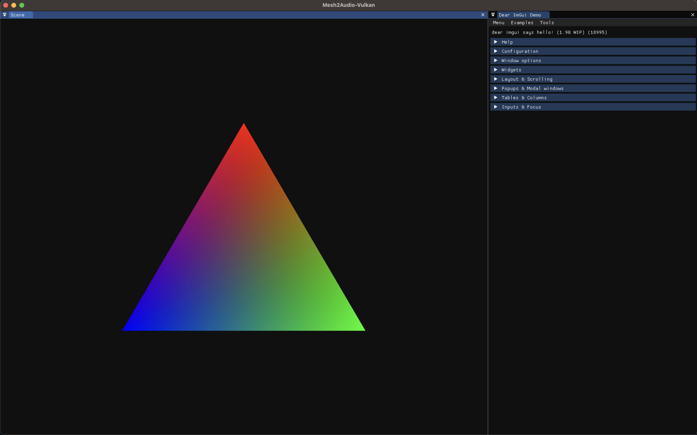

# ImGuiVulkanHppImage

A demo application for rendering a triangle with Vulkan-Hpp into a docked ImGui window via `Shaders->vk::Image->MSAA->Texture->ImGui::Image`, with an SDL3 backend.



## Clone/build/run

- Clone recursively
  ```shell
  $ git clone --recurse-submodules git@github.com:khiner/ImGuiVulkanHppImage.git
  ```
- Download and install the latest SDK from https://vulkan.lunarg.com/sdk/home
- Set the `VULKAN_SDK` environment variable.
  For example, add the following to your `.zshrc` file:
  ```shell
  export VULKAN_SDK="$HOME/VulkanSDK/{version}/macOS"
  ```
- Build/Run
  ```shell
  $ mkdir build && cd build && cmake ..
  $ make
  $ ./ImGuiVulkanHppImage
  ```
